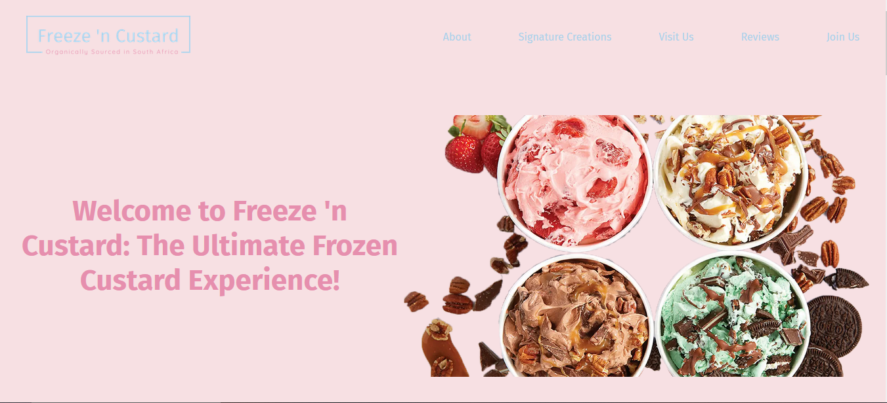

# Project Title

Freeze 'n Custard

## Demo Link:

Access my site at https://59mrrobot.github.io/freeze-n-custard/

## About The App:

A simple single-page application for an upcoming frozen custard brand, Freeze 'n Custard. The site consists of a section with the brand's values, a slider which showcases the brand's signature creations, a map that let's users find stores near them, a newsletter sign-up form, and reviews from some customers.

## Screenshots:

## Technologies:

- React
- Typescript
- HTML
- React Router
- React Router Hash Link
- Material UI

## Setup:

- Download or clone the repository.
- Install by running `npm install`.
- Start the server by running `npm start`.
- Visit the app at `http://localhost:3000/`.
